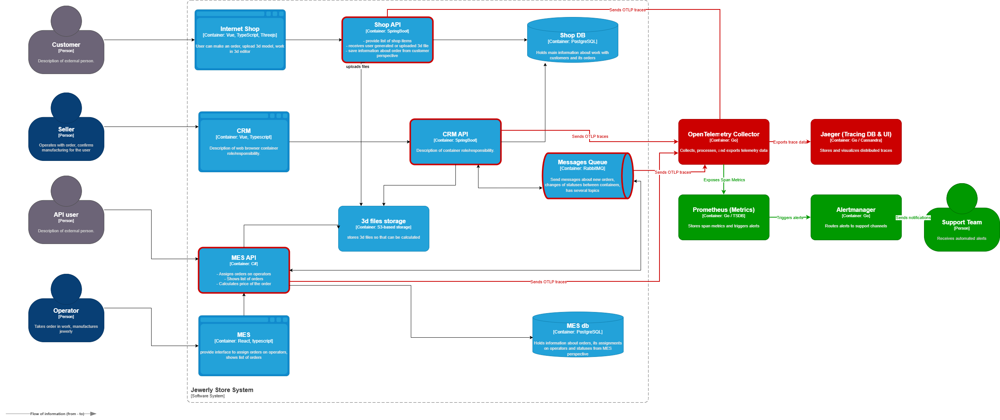

# Архитектурное решение по трейсингу

## 1. Анализ системы и места возможных сбоев

В текущей микросервисной архитектуре компании «Александрит» взаимодействие между ключевыми узлами происходит асинхронно через брокер сообщений RabbitMQ. Это создает «слепые зоны», в которых заказы могут бесследно теряться или находиться в неопределенном состоянии неделями. 

На доработанной диаграмме контейнеров C4 **жирным красным контуром** выделены системы, которые подлежат обязательному покрытию трейсингом:

* **Shop API (Java Spring Boot):** Точка входа для B2C-клиентов. Заказ может «сломаться» на этапе отправки сообщения в RabbitMQ / при сбое транзакции записи в `Shop DB` после прохождения шагов `INITIATED` и `FILE_UPLOADED`.
* **CRM API (Java Spring Boot):** Точка интеграции с внешними B2B-продавцами. При обработке массовых заказов через открытый API запросы могут обрываться по таймауту, либо CRM API может не зафиксировать ответную квитанцию от MES, из-за чего статус `MANUFACTURING_APPROVED` или `CLOSED` не синхронизируется.
* **Messages Queue (RabbitMQ):** Главный транспорт. Сообщения могут оседать в очередях, застревать в состоянии *Unacknowledged* / автоматически уничтожаться при некорректной настройке TTL (Time To Live). Трейсинг брокера необходим для фиксации точного времени нахождения сообщения «в полете».
* **MES API (C#):** Самый уязвимый узел системы. Время расчета стоимости сложной 3D-модели варьируется от 2 до 30 минут. При пиковой нагрузке поток вычислений может упасть по ошибке *Out of Memory (OOM)*, завершиться по таймауту базы данных `MES db` или зависнуть на этапе смены статуса (`PRICE_CALCULATED`, `MANUFACTURING_STARTED`). Без трейсинга этот процесс полностью скрыт от команды поддержки.

---

## 2. Данные для трейсинга

Для сквозной идентификации каждого запроса и обеспечения возможности быстрого поиска, каждый спан внутри трейса должен содержать сл. контекст.

### Системные атрибуты (Спецификация W3C Trace Context):
* `trace_id` — глобальный уникальный 16-байтный идентификатор всей цепочки прохождения заказа. Генерируется на первой точке входа запроса (`Shop API` или `CRM API`) и прокидывается через заголовки HTTP (`traceparent`) и свойства сообщений RabbitMQ.
* `span_id` — уникальный 8-байтный идентификатор конкретной атомарной операции внутри одного сервиса (например, метод `calculatePrice()` в MES API).
* `parent_span_id` — идентификатор родительского спана, позволяющий воссоздать иерархическое дерево вызовов.

### Бизнес-контекст (Атрибуты и Baggage):
* `messaging.rabbitmq.queue` — имя обрабатываемой очереди в RabbitMQ.
* `order.id` — сквозной идентификатор заказа (ключевой параметр для поиска поддержки).
* `customer.id` / `b2b.partner.id` — идентификатор клиента или внешнего контрагента.
* `order.status` — текущий статус модели конечного автомата заказа (например, `SUBMITTED`, `PRICE_CALCULATED`).
* `3d.polygon.count` — количество полигонов в загруженной 3D-модели (для профилирования MES API).

### Метаданные и логирование ошибок:
* `service.name` — имя компонента (`shop-api`, `crm-api`, `mes-api`).
* `span.kind` — тип спана (`SERVER` для входящих HTTP, `CLIENT` для исходящих, `PRODUCER` / `CONSUMER` для RabbitMQ).
* `status.code` — результат операции (`OK` или `ERROR`).
* `error.message` / `exception.stacktrace` — подробный текст ошибки и стек вызовов в случае падения операции.

---

## 3. Мотивация

**Зачем системе нужен трейсинг:**
Внедрение распределенного трейсинга превращает ИТ-ландшафт «Александрита» из черного ящика в прозрачную систему. Трейсинг связывает разрозненные события асинхронного брокера сообщений в единую временную шкалу. Команда получает инструмент визуализации и быстро локализовать компонент сбоя.

### Влияние на ключевые метрики (Бизнес и Технические):

| Метрика | Тип метрики | Текущее состояние | Целевое состояние после внедрения |
| :--- | :--- | :--- | :--- |
| **MTTR (Mean Time to Resolution)** | Техническая | Часы или дни (разбор инцидентов со слов клиентов вручную по логам) | **< 15 минут** (мгновенное определение упавшего сервиса по ID трейса) |
| **B2B SLA Compliance Rate** | Бизнес | Падение из-за расторжения крупных контрактов и потери заказов | **> 99.5%** (контроль застревания заказов на этапах MES) |
| **AHT (Average Handling Time) поддержки** | Бизнес | Высокое (перенаправление тикетов на разработчиков для ручного аудита БД) | **Снижение на 70%** (первая линия поддержки самостоятельно видит трейс заказа) |
| **Error Rate (Процент ошибок)** | Техническая | Неизвестен (ошибки тушатся внутри асинхронных консьюмеров) | **Проактивный контроль** утилизации пула потоков и падений MES API |

---

## 4. Предлагаемое решение

Для реализации распределенного трейсинга используем стандарт **OpenTelemetry (OTel)** совместно с экосистемой **Jaeger** в качестве бэкенда для хранения и визуализации.

### Технологический стек и компоненты:
1. **OpenTelemetry SDK (Инструментация приложений):**
   * Для `Shop API` и `CRM API` (Java) подключается официальный *OpenTelemetry Java Instrumentation Agent*. Он автоматически без изменения кода перехватывает входящие/исходящие HTTP-вызовы (Spring Web) и транзакции к БД PostgreSQL.
   * Для `MES API` (C#) подключаются NuGet-пакеты *OpenTelemetry.Instrumentation.AspNetCore* и *OpenTelemetry.Instrumentation.EntityFrameworkCore*. Дорабатывается кастомная инструментация для RabbitMQ-консьюмера для извлечения `trace_id` из свойств сообщения.
2. **OpenTelemetry Collector:** Выделенный легковесный прокси-сервис. Он разворачивается как отдельный контейнер, принимает трейсы от всех приложений по высокопроизводительному протоколу OTLP (gRPC), производит пакетную обработку (batching), фильтрацию и управляет политиками сэмплирования.
3. **Jaeger (Query & UI + Storage):** Принимает агрегированные данные от OTel Collector. Предоставляет веб-интерфейс для поиска трейсов по тегам (например, `order.id = 12543`) и визуализации графа вызовов. Данные складываются в Managed DB ClickHouse/Elasticsearch для долгосрочного хранения.

### Архитектурные изменения на C4-схеме (Выделено Красным цветом):
* Добавлены новые инфраструктурные контейнеры: `OpenTelemetry Collector` и `Jaeger (Tracing DB & UI)`.
* Проложены новые интеграционные связи: от `Shop API`, `CRM API` и `MES API` проведены направленные gRPC-потоки к `OpenTelemetry Collector` с типом данных *Sends OTLP traces*.
* `OpenTelemetry Collector` транслирует обработанную информацию в `Jaeger` по связи *Exports trace data*.

---

## 5. Компромиссы

1. **Накладные расходы на инфраструктуру (Overhead):** Агенты трейсинга создают дополнительную нагрузку на CPU и увеличивают размер HTTP-заголовков из-за передачи метаданных. Передача трейсов создает дополнительный сетевой трафик (Network IO).
2. **Стоимость хранения данных:** При линейном росте на 100 заказов в месяц и тысячах B2B-запросов к API, объем сырых трейсов начнет измеряться терабайтами. Для компромисса вводится **Head-based Sampling** на уровне OTel Collector: мы сохраняем 100% трейсов, содержащих ошибки (`status.code = ERROR`) или задержку вычислений > 5 секунд, и только 10% гарантированно успешных трейсов (`HTTP 200`).
3. **Границы применимости (Слепые зоны):** Трейсинг бессилен внутри закрытого скомпилированного ядра MES-системы, отвечающего непосредственно за математический просчет геометрии полигонов. Мы можем измерить только время «до» входа в расчетный метод and «после» выхода из него.

---

## 6. Безопасность

* **Изоляция сетевого контура:** Компоненты `OpenTelemetry Collector` и порты сбора данных `Jaeger` размещаются внутри приватной виртуальной сети (VPC). Они закрыты от внешнего интернета и принимают трафик только от доверенных IP-адресов внутренних инстансов EC2.
* **Аутентификация и Ролевая модель (RBAC):** Доступ к веб-интерфейсу `Jaeger UI` для просмотра графов трейсинга закрыт публично. Интегрируется корпоративное SSO (Keycloak / Active Directory). Настраиваются три роли доступа:
  * `Admin/DevOps` — управление конфигурацией коллектора и очисткой индексов.
  * `Developer` — полный доступ к трассировке всех окружений для отладки.
  * `Support_L2` — доступ только к чтению (Read-Only) прод-окружения для поиска зависших заказов по бизнес-тегам.
* **Маскирование персональных данных (PII):** В конфигурации `OpenTelemetry Collector` рабоает процессор обработки атрибутов (`attributes/filter`). Все чувствительные данные клиентов (ФИО, номера телефонов, хэши паролей, параметры платежных шлюзов) принудительно вырезаются или маскируются строкой `[REDACTED]` до момента записи трейса в постоянное хранилище Jaeger.

---

## 7. Дополнительное задание: Автоматический мониторинг и алертинг прохождения заказа

### Архитектурное решение по автоматизации контроля:
Вместо пассивного ожидания жалоб операторов или клиентов, система переводится на проактивный мониторинг бизнес-процессов на основе потока распределенных трейсов. 

Для этого задействуется паттерн **Span Metrics** и механизм аналитики внутри OTel Collector:

1. **Генерация метрик из трейсов:** OTel Collector на лету агрегирует проходящие спаны от RabbitMQ-консьюмеров. Если коллектор видит спан отправки сообщения со статусом `SUBMITTED`, но в течение 10 минут (скользящее окно) для этого `trace_id` не появляется дочерний спан из MES API со статусом `MANUFACTURING_STARTED` (оператор взял в работу), коллектор генерирует кастомную бизнес-метрику утерянного или зависшего заказа.
2. **Сбор и Хранение метрик (Выделено Зеленым цветом):** Из OTel Collector метрики прохождения заказов выставляются наружу в формате Prometheus. Специализированный инстанс `Prometheus (Metrics)` собирает эти данные методом pull.
3. **Алертинг:** При превышении пороговых значений (например, количество зависших заказов в очереди > 5 штук за последние 5 минут) Prometheus триггерит правило алертинга и отправляет сигнал в `Alertmanager`.
4. **Маршрутизация уведомлений:** `Alertmanager` дедуплицирует алерты и отправляет нотификацию с указанием конкретных `order_id` в мессенджер/канал дежурной смены `Support Team` (Выделена зеленым цветом на схеме).

### Архитектурные изменения на C4-схеме (Выделено Зеленым цветом):
* Добавлены контейнеры мониторинга: `Prometheus (Metrics)` and `Alertmanager`.
* Добавлен участник: `Support Team` (Служба поддержки).
* Проложены зеленые связи: от `OpenTelemetry Collector` к `Prometheus` (*Exposes Span Metrics*), от `Prometheus` к `Alertmanager` (*Triggers alerts*), от `Alertmanager` к `Support Team` (*Sends notifications*).