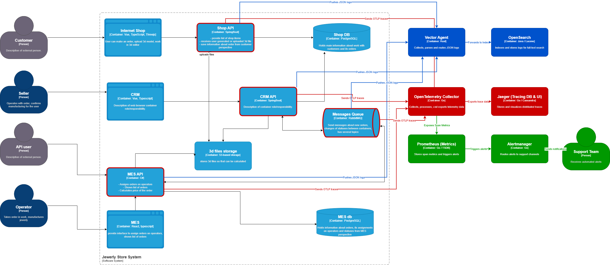

# Архитектурное решение по логированию

## 1. Анализ системы и стратегия логирования

Для устранения ситуации, когда разбор инцидентов происходит исключительно «со слов клиента», в ИТ-ландшафт компании «внедряется сквозное централизованное логирование. Сбор логов необходимо настроить со всех бэкенд-компонентов (`Shop API`, `CRM API`, `MES API``RabbitMQ`).

### 1.1. Перечень необходимых логов уровня INFO (Жизненный цикл заказа)

Все логи уровня `INFO` структурируются в формате **JSON** для автоматического парсинга и должны содержать обязательные системные поля: `timestamp`, `trace_id`, `service_name`, `environment` (prod/release/dev), `actor_id` (ID пользователя или системы).

Основные бизнес-события, подлежащие фиксации:
1. **Создание черновика / Корзины (`Shop API`):**
   * *Контекст:* `time`, `order_id`, `customer_id`, `status: INITIATED`.
2. **Загрузка 3D-модели (`Shop API` / `MES API`):**
   * *Контекст:* `time`, `order_id`, `customer_id`, `file_id`, `file_size_bytes`, `polygon_count`, `status: FILE_UPLOADED`.
3. **Фиксация заказа пользователем (`Shop API` / `CRM API`):**
   * *Контекст:* `time`, `order_id`, `customer_id`, `channel` (b2c_web / b2b_api), `status: SUBMITTED`.
4. **Прием сообщения из очереди на расчет (`MES API`):**
   * *Контекст:* `time`, `order_id`, `queue_name`, `message_id`, `event: START_PRICE_CALCULATION`.
5. **Завершение расчета стоимости (`MES API`):**
   * *Контекст:* `time`, `order_id`, `calculated_price`, `duration_ms`, `status: PRICE_CALCULATED`.
6. **Подтверждение заказа в производство (`CRM API`):**
   * *Контекст:* `time`, `order_id`, `manager_id`, `status: MANUFACTURING_APPROVED`.
7. **Старт производства оператором (`MES API`):**
   * *Контекст:* `time`, `order_id`, `operator_id`, `status: MANUFACTURING_STARTED`.
8. **Завершение производства и переход к упаковке (`MES API`):**
   * *Контекст:* `time`, `order_id`, `operator_id`, `status: MANUFACTURING_COMPLETED` / `PACKAGING`.
9. **Отгрузка заказа в доставку (`MES API`):**
   * *Контекст:* `time`, `order_id`, `delivery_service_id`, `tracking_number`, `status: SHIPPED`.
10. **Закрытие заказа (`CRM API`):**
    * *Контекст:* `time`, `order_id`, `close_reason` (delivered / cancelled), `status: CLOSED`.

### 1.2. Использование других уровней логирования

* **DEBUG:** Используется разработчиками в процессе локальной отладки и на `dev`-окружении. Логируются детальные шаги выполнения алгоритмов (например, промежуточные этапы парсинга полигонов 3D-модели, raw-ответы от СУБД). На `prod`-окружении данный уровень по умолчанию отключен для экономии дискового пространства.
* **WARN (Предупреждения):** Логируются некритичные аномалии, при которых система продолжает выполнять бизнес-логику, но зафиксировано странное поведение. 
  * *Пример:* Повторная отправка сообщения в RabbitMQ из-за краткосрочной сетевой задержки; время расчета стоимости в MES превысило 15 минут (но расчет завершился успешно); B2B-клиент прислал некорректный формат файла, который был отвергнут валидатором (ошибка 400).
* **ERROR (Ошибки):** Логируются ситуации, при которых конкретный запрос пользователя или обработка сообщения завершились неудачей, но приложение сохранило общую работоспособность.
  * *Пример:* База данных вернула ошибку уникальности при записи заказа; RabbitMQ недоступен в течение нескольких секунд; MES API выбросил Exception при попытке обработать битый файл модели. Лог обязательно должен содержать стек вызовов (`stacktrace`) и `trace_id`.
* **FATAL/CRITICAL:** Логируются катастрофические сбои, приводящие к аварийной остановке всего инстанса приложения.
  * *Приmer:* Отсутствие соединения с БД при старте сервиса; повреждение файлов конфигурации; исчерпание оперативной памяти (Out of Memory). Требует немедленного вмешательства DevOps-инженеров.

---

## 2. Мотивация

**Зачем системе нужно логирование:**
Без централизованного логирования разбор инцидентов не работает: поддержка тратит часы на ручные SQL-запросы к базам данных `Shop DB` и `MES db`, пытаясь восстановить хронологию событий по косвенным признакам. Единая система логирования позволяет мгновенно восстановить пошаговую историю любого заказа по его идентификатору (`order_id`).

### Влияние на ключевые метрики:
1. **MTTR (Mean Time to Resolution) [Техническая]:** Сократится кратно. Инженеры смогут в один клик увидеть точный Exception и контекст сбоя.
2. **Доля успешно разрешенных тикетов на L1/L2 (FCR - First Contact Resolution) [Бизнес]:** Увеличится до 50%. Поддержка сможет давать клиентам точные ответы («Ваш заказ находится на этапе упаковки с 14:00»), не привлекая разработчиков бэкенда.
3. **SLA обработки B2B-заказов [Бизнес]:** Минимизация финансовых потерь от расторжения контрактов с внешними продавцами за счет сокращения времени обнаружения «зависших» API-запросов.
4. **Утилизация дискового пространства и IOPS [Техническая]:** Оптимизация за счет структурирования логов и отключения избыточного вывода в консоль на прокшене.

---

## 3. Стратегия поэтапного внедрения и приоритеты

Команда из 8 человек не может одновременно переписать код всех систем. Учитывая критичность проблем, внедрение разбивается на этапы:

* **Высший приоритет (Этап 1): `MES API` и `Messages Queue (RabbitMQ)`**
  * *Почему:* Основная точка деградации и жалоб операторов — дашборд MES и долгие расчеты (до 30 минут). Именно здесь «пропадают» заказы. Логирование брокера сообщений и консьюмеров MES позволит понять, доходят ли сообщения до производства и на каких геометрических моделях спотыкается C#-бэкенд.
* **Средний приоритет (Этап 2): `CRM API` (B2B API контур)**
  * *Почему:* Компания теряет крупные B2B-контракты. Нам нужно логировать API, чтобы доказать или опровергнуть вину нашей системы при взаимодействии с внешними продавцами.
* **Низший приоритет (Этап 3): `Internet Shop` и `CRM` (фронтенд-логирование)**
  * *Почему:* В B2C-сегменте уже есть Яндекс Метрика, которая частично закрывает базовые потребности мониторинга интерфейса. Полное покрытие фронтенда логами (сбор клиентских JS-ошибок) откладывается до стабилизации серверной части.

---

## 4. Предлагаемое решение

Для реализации логирования используем стек **OpenSearch** (современное развитие классического ELK, полностью соответствующее концепции open-source).

### Компоненты архитектуры сбора логов:
1. **Логгеры приложений:** Использование стандартных асинхронных библиотек с выводом в `stdout` в формате JSON (Logback для Java Spring Boot, Serilog для C#). Асинхронность критична, чтобы процесс записи лога не блокировал основной поток вычислений MES.
2. **Агенты сбора (Vector / Fluent Bit):** Легковесные демоны, разворачиваемые на EC2-инстансах рядом с приложениями. Они подписываются на потоки контейнеров, агрегируют логи, обогащают их метаданными (ID инстанса) и отправляют в центральное хранилище.
3. **Хранилище и Визуализация (OpenSearch + OpenSearch Dashboards):** Кластер для индексации, хранения и текстового поиска по логам.

### Изменения на C4-схеме:
* На схему добавляются новые контейнеры: `Vector Agent` (на каждом EC2), центральный кластер `OpenSearch` и UI-компонент `OpenSearch Dashboards`.
* Прокладываются связи от бэкендов к локальным агентам, а от них — к `OpenSearch`.

---

## 5. Политика безопасности

* **Маскирование чувствительных данных (PII):** На уровне конфигурации библиотек логирования приложений (Logback/Serilog) внедряются регулярные выражения, которые на лету заменяют конфиденциальные данные (номера платежных карт, пароли, хэш-токены JWT, персональные данные клиентов) на шаблон `[MASKED]`.
* **Управление доступом (RBAC):** Доступ к OpenSearch Dashboards интегрируется с SSO. Настраиваются роли:
  * `Support_L1`: Доступ только к логам со статусами INFO/WARN для поиска заказов.
  * `Developers`: Полный доступ к INFO/WARN/ERROR/DEBUG во всех окружениях.
  * `DevOps/Sec`: Доступ к конфигурации индексов и системным логам аудита.

---

## 6. Политика хранения (Retention Policy)

Для эффективного управления стоимостью облачной инфраструктуры Yandex Cloud вводится разделение по индексам и жизненному циклу данных (ILM):

* **Разделение по индексам:** Каждое приложение пишет в свой ежедневный индекс (например, `logs-mes-api-prod-YYYY.MM.DD`, `logs-shop-api-prod-YYYY.MM.DD`). Это изолирует тяжелые логи MES от легковесных логов магазина.
* **Жизненный цикл (Ротация логов):**
  * **Hot-зона (Быстрые диски):** Логи хранятся **7 дней**. Доступны для мгновенного полнотекстового поиска в OpenSearch Dashboards.
  * **Warm-зона (Дешевые диски):** Логи хранятся с **8 по 30 день**. Индексы переводятся в режим Read-Only, сжимаются. Поиск работает медленнее.
  * **Cold-зона (Архив в S3):** По истечении 30 дней логи автоматически экспортируются в бакет Yandex Object Storage (S3) в виде сжатых архивов, где хранятся еще **60 дней** на случай глубокого аудита, после чего уничтожаются навсегда.
* **Объем данных:** Исходя из линейного роста на 100 заказов/мес, прогнозируемый объем сырых логов на прод-окружении составит около **15-20 Гб в сутки** (с учетом тяжелых логов валидации 3D-файлов). Выделяется базовый лимит в 600 Гб на дисковом хранилище OpenSearch.

---

## 7. Анализ логов, алертинг и поиск аномалий

Система сбора логов преобразуется в аналитическую систему с помощью встроенного модуля **OpenSearch Anomaly Detection** и механизмов алертинга:

1. **Алертинг по критическим событиям:** Настраиваются триггеры на появление логов уровня `FATAL` или резкий всплеск (более 50 логов в минуту) уровня `ERROR` для любого микросервиса. Оповещения уходят в Telegram-канал дежурных инженеров.
2. **Поиск аномалий (Защита от DDoS и спама B2B API):**
   * *Сценарий:* Система фиксирует базовый паттерн — в среднем 4 записи о создании заказов в секунду. Если частота появления логов `status: INITIATED` или `status: SUBMITTED` возрастает до 10 000 в секунду, алгоритмы машинного обучения OpenSearch фиксируют аномалию.
   * *Действие:* Срабатывает критический алерт, отправляется нотификация DevOps-инженеру, на уровне API-шлюза временно активируется жесткий Rate Limiting для подозрительных IP-адресов или конкретного токена B2B-партнера, спамящего систему.

---

## 8. Дополнительное задание: Сравнительный анализ технологий

| Критерий | ELK Stack (Elastic) | OpenSearch (Выбор) | Splunk | Grafana Loki |
| :--- | :--- | :--- | :--- | :--- |
| **Лицензия** | Elastic License (Проприетарная/Ограниченная) | **Apache License 2.0** (Полностью бесплатный OpenSource) | Коммерческая (Очень дорогая, плата за объем данных) | Apache License 2.0 |
| **Потребление ресурсов** | Высокое (Logstash и Elasticsearch требуют много RAM) | **Высокое** (Идентично Elastic, требует тщательного тюнинга Java Heap) | Среднее (Оптимизированное С-ядро) | **Низкое** (Не индексирует текст логов, только лейблы, минимальный футпринт) |
| **Полнотекстовый поиск** | Отличный (Отраслевой стандарт на базе Apache Lucene) | **Отличный** (Полный аналог Elasticsearch, мощные поисковые возможности) | Отличный (Собственные проприетарные индексы) | Слабый (Поиск перебором/grep, не подходит для сложной аналитики) |
| **Экосистема / Сообщество** | Огромная, но коммерциализируется | **Активно растет** (Поддерживается AWS, Yandex Cloud и крупными игроками) | Корпоративная закрытая | Огромная внутри CNCF (Идеальная интеграция с Grafana) |
| **Сложный анализ и ML** | Доступно в платных подписках | **Включено бесплатно** (Модули Anomaly Detection и Алертинг доступны из коробки) | Доступно на высших тарифах | Ограничено базовыми функциями LogQL |

**Обоснование выбора:** `OpenSearch` выбран как оптимальный компромисс между мощным полнотекстовым поиском (который необходим поддержке для поиска по тексту ошибок и стектрейсам в MES) и юридической чистотой лицензии Apache 2.0. Он бесшовно предоставляется как Managed-сервис в Yandex Cloud, что снимает с нашего единственного DevOps-инженера задачу ручного администрирования кластера баз данных.